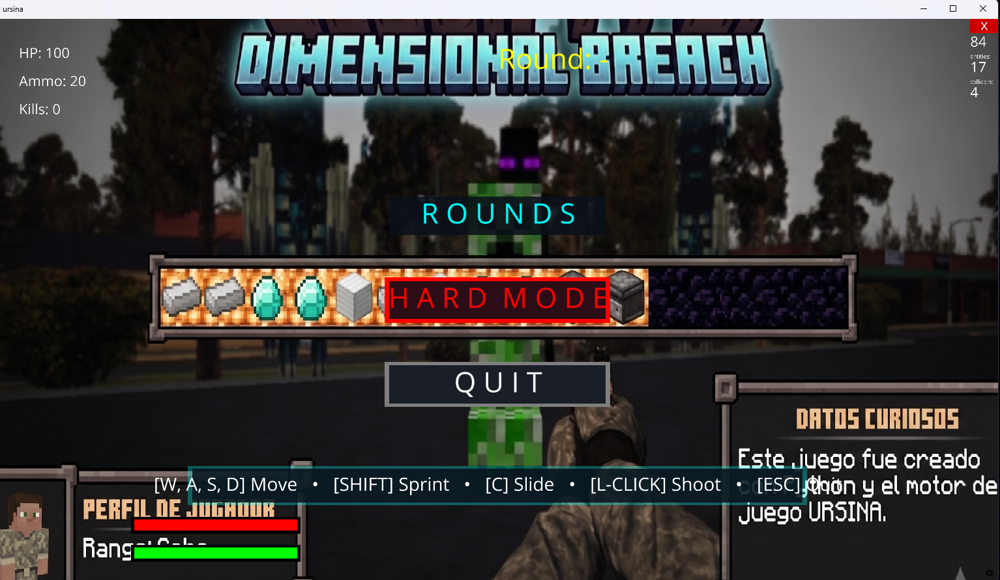
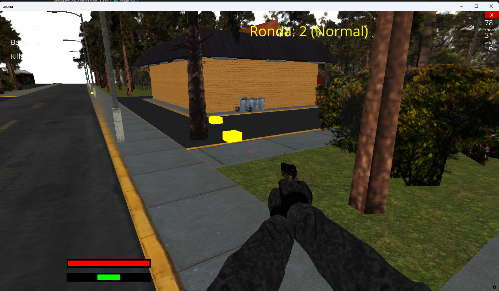

# SHOOTER-3D

An action-packed 3D first-person shooter (FPS) survival game built in Python using the **Ursina Engine**. Battle against waves of iconic creatures (Creepers, Skeletons, Endermen, Wardens, and Withers) in a modular codebase.


## 🚀 Installation & Requirements

### Prerequisites
* **Python 3.8 or higher** installed on your system.

### Dependencies
Install the required packages by running:

```bash
pip install -r requirements.txt
```

---

## 🎮 How to Play

Run the main script from the root directory of the project:

```bash
python src/main.py
```

### Controls
* **W, A, S, D**: Movement
* **SHIFT**: Sprint (consumes stamina)
* **C**: Slide (quick slide on the ground)
* **LEFT CLICK**: Shoot
* **ESC**: Quit game immediately

---

## ⚔️ Game Modes
1. **ROUNDS (Normal)**:
   - Survive consecutive waves of enemies with scaling difficulty.
   - Early rounds spawn basic enemies, while higher rounds introduce elite monsters.
2. **HARD**:
   - Spawns all elite monsters (including Withers and Wardens) right from the start in high quantities.

---

## 📁 Project Structure

The codebase is organized modularly for easy extension:

```text
SHOOTER-3D/
│
├── Capturas/             # Game screenshots
├── Modelos_3d/           # 3D models and textures (.glb, .obj, .mtl)
├── src/
│   ├── main.py           # Application entry point
│   └── juego/
│       ├── logica.py     # Main loop coordinator, damage, collisions, and state
│       ├── entidades/    # Player, weapon, and enemy entity classes
│       ├── escena/       # Window, level map (laundry.glb), and lighting setup
│       ├── interfaz/     # Main menu and in-game HUD (health, stamina, ammo)
│       └── sistemas/     # Movement limits, wave spawning, ammo, and firing systems
│
├── .gitignore            # Git exclusion rules
└── requirements.txt      # Python dependencies list
```
---

## 🛠️ Architecture & Technical Details

The project is built on top of the **Ursina Engine** (wrapping Panda3D). Below are the core technical systems and code implementations:

### 1. Game Entry Point & Loop Delegation
The main application initializes Ursina and delegates frame updates and player inputs directly to the modularized logic controller:

```python
# src/main.py
from ursina import Ursina
from juego.logica import setup_game, update as game_update, input as game_input

app = Ursina()
setup_game()

def update():
    game_update()

def input(key):
    game_input(key)

if __name__ == '__main__':
    app.run()
```

### 2. Entity Architecture & Inheritance
Enemies inherit from a core `BaseMonster` entity that handles 3D model orientation, hitboxes, headshot headboxes, and floating health bars:

```python
# src/juego/entidades/enemigos.py
class BaseMonster(Entity):
    def __init__(self, position, mesh_model, mesh_scale, mesh_offset_y,
                 speed, max_health, collider_scale, head_offset, head_scale):
        super().__init__(
            model=None,
            position=position,
            scale=collider_scale,
            collider='box'
        )
        self.health = max_health
        self.max_health = max_health
        self.speed = speed

        # Visual model representation
        self.mesh = Entity(
            parent=self,
            model=mesh_model,
            scale=mesh_scale,
            y=mesh_offset_y,
            rotation=(0, 180, 0)
        )
        
        # Dedicated headshot hitbox
        self.headbox = Entity(
            parent=self,
            model='cube',
            collider='box',
            position=head_offset,
            scale=head_scale,
            color=color.clear
        )
        
        # Floating health bar
        bar_y = collider_scale.y * 2.0
        self.bar_bg = Entity(parent=self, model='quad', color=color.black, scale=(0.4, 0.07), position=(0, bar_y, 0))
        self.bar_fg = Entity(parent=self, model='quad', color=color.red, scale=(0.38, 0.05), position=(0, bar_y, -0.01))

    def update_bar(self):
        self.bar_fg.scale_x = 0.38 * max(self.health, 0) / self.max_health
```

### 3. Sleek UI Layout & Hover Animations
Buttons in the menu are created using nested parent-child entities to support glowing borders, utilizing a custom scale-canceling calculation to keep text undistorted:

```python
# src/juego/interfaz/menu.py
def create_custom_button(text, position, base_border_color, hover_border_color, text_color, action):
    # Outer glowing border / frame
    border = Entity(
        parent=camera.ui,
        model='quad',
        color=base_border_color,
        scale=(0.4, 0.08),
        position=(position[0], position[1], 0)
    )
    
    # Inner sleek glass-morphic button
    btn = Button(
        parent=border,
        model='quad',
        color=color.rgba(10/255, 15/255, 25/255, 220/255),
        highlight_color=color.rgba(25/255, 35/255, 55/255, 230/255),
        pressed_color=color.rgba(5/255, 8/255, 15/255, 240/255),
        scale=(0.96, 0.85),
        position=(0, 0, -0.01)
    )
    
    btn.text = text
    # Counteract both border and button scaling to make text uniform and clear
    btn.text_entity.scale_x = 2.0 / (border.scale_x * btn.scale_x)
    btn.text_entity.scale_y = 2.0 / (border.scale_y * btn.scale_y)
```

---

## 📸 Screenshots

### Main Menu


### Gameplay - Round 1


### Ammo Box Collection


### Hard Mode Chaos


---
